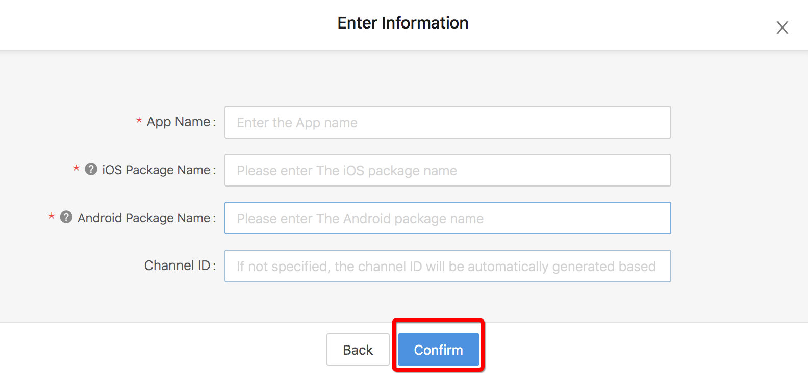

# Integrate SDK


## Solutions introduction

Before integrate Tuya smart camera SDK, please learn about [Home SDK](https://tuyainc.github.io/tuyasmart_home_android_sdk_doc/en/).

The Tuya Open Platform provides rious integrate modes based on Tuya's mature IoT services, refer to [Solutions Introduction](https://docs.tuya.com/en/iot/open-api/quick-start/solution-overview?id=K95ztz6mui51y).
 
## Preparation for Integration

1. Click "App Service" - "App SDK" - "Obtain SDK" in order on the iot platform.


2. Select the appropriate development plan according to your needs and click "Next".

  

3. Enter the created app information as prompted and click "Next."



4. AppKey, AppSecret can be obtained in the Android section. Click "Download" and " Download Android-based App SDK(Gradle)" to download the required security images and dependencies.


##  Create Project

Build your project in the Android Studio.


### Configure the build.gradle

Add the following codes to the root build.gradle file.
```groovy
buildscript {

    repositories {
        ...
        maven {
            url 'https://maven-other.tuya.com/repository/maven-releases/'
        }
        maven {
            url 'https://maven-other.tuya.com/repository/maven-snapshots/'
        }
    }
    dependencies {
        classpath 'com.android.tools.build:gradle:3.1.4'
				classpath 'com.tuya.android.module:tymodule-config:0.4.0-SNAPSHOT'
        // NOTE: Do not place your application dependencies here; they belong
        // in the individual module build.gradle files
    }
}

allprojects {
    repositories {
        ...
        maven {
            url 'https://maven-other.tuya.com/repository/maven-releases/'
        }
        maven {
            url 'https://maven-other.tuya.com/repository/maven-snapshots/'
        }
    }
}
```

Add the following codes to the app build.gradle file.

```groovy
apply plugin: 'tymodule-config'
defaultConfig {
    ndk {
        abiFilters "armeabi-v7a","arm64-v8a"
    }
 }
    dependencies {
        implementation fileTree(dir: 'libs', include: ['*.jar', '*.aar'])
        implementation 'com.alibaba:fastjson:1.1.67.android'
        implementation 'com.squareup.okhttp3:okhttp-urlconnection:3.12.3'
        // implementation 'org.eclipse.paho:org.eclipse.paho.client.mqttv3:1.2.0'

        // required tuya home sdk
        implementation 'com.tuya.smart:tuyasmart:3.17.0-beta1'

        // tuya camera module
        implementation 'com.tuya.smart:tuyasmart-ipc-camera-middleware:3.14.3r133'
        implementation 'com.tuya.smart:tuyasmart-ipc-camera-v2:3.17.0r139'
        implementation 'com.tuya.smart:tuyasmart-ipc-camera-utils:3.13.0r129h1'
        implementation 'com.tuya.smart:tuyasmart-ipc-camera-message:3.13.0r128'
        implementation 'com.tuya.smart:tuyasmart-ipc-devicecontrol:3.17.0r139'
        //messge center imagepipeline 
        implementation 'com.tuya.smart:tuyasmart-imagepipeline-okhttp3:0.0.1'
        implementation 'com.facebook.fresco:fresco:1.3.0'

        //Mall components
        implementation 'com.tuya.smart:tuyasmart-webcontainer:3.17.6r141-open'
        implementation 'com.tuya.smart:tuyasmart-xplatformmanager:1.1.0'
        implementation "com.tuya.smart:tuyasmart-base:3.17.0r139-rc.3"
        implementation 'com.tuya.smart:tuyasmart-appshell:3.10.0'
        implementation "com.tuya.smart:tuyasmart-stencilwrapper:3.17.0.2r139"
        implementation "com.tuya.smart:tuyasmart-framework:3.17.0.2r139-external"
        implementation 'com.tuya.smart:tuyasmart-uispecs:0.0.5'
    }

repositories {
    mavenLocal()
    jcenter()
    google()
}
```

> 【Tips】 TuyaSmart Camera Android sdk solely supports the platform of armeabi-v7a,arm64-v8a


### Set the AndroidManifest.xml

Set appkey and appSecret in the AndroidManifest.xml file, and configure corresponding permissions, etc.

```xml
<meta-data
android:name="TUYA_SMART_APPKEY"
android:value="App id" />
<meta-data
android:name="TUYA_SMART_SECRET"
android:value="App key" />

<!-- sdcard -->
<uses-permission android:name="android.permission.WRITE_EXTERNAL_STORAGE" />
<uses-permission android:name="android.permission.READ_EXTERNAL_STORAGE" />
<!-- Network -->
<uses-permission android:name="android.permission.INTERNET" />
<uses-permission android:name="android.permission.CHANGE_NETWORK_STATE" />
<uses-permission android:name="android.permission.CHANGE_WIFI_STATE" />
<uses-permission android:name="android.permission.ACCESS_NETWORK_STATE" />
<uses-permission android:name="android.permission.ACCESS_WIFI_STATE" />
<uses-permission android:name="android.permission.RECORD_AUDIO" />
<uses-permission android:name="android.permission.MODIFY_AUDIO_SETTINGS" />
```


### Proguard-rules

Arrange aliasing configuration in corresponding proguard-rules.pro files.

```bash
#fastJson
-keep class com.alibaba.fastjson.**{*;}
-dontwarn com.alibaba.fastjson.**

#mqtt
-keep class com.tuya.smart.mqttclient.mqttv3.** { *; }
-dontwarn com.tuya.smart.mqttclient.mqttv3.**

#tutk
-keep class com.tutk.**{*;}
-dontwarn com.tutk.**

-keep class com.squareup.okhttp.** { *; }
-keep interface com.squareup.okhttp.** { *; }
-dontwarn com.squareup.okhttp.**

-keep class okio.** { *; }
-dontwarn okio.**

-keep class com.tuya.**{*;}
-dontwarn com.tuya.**
-keep class com.tuyasmart.**{*;}
-dontwarn com.tuyasmart.**
```

