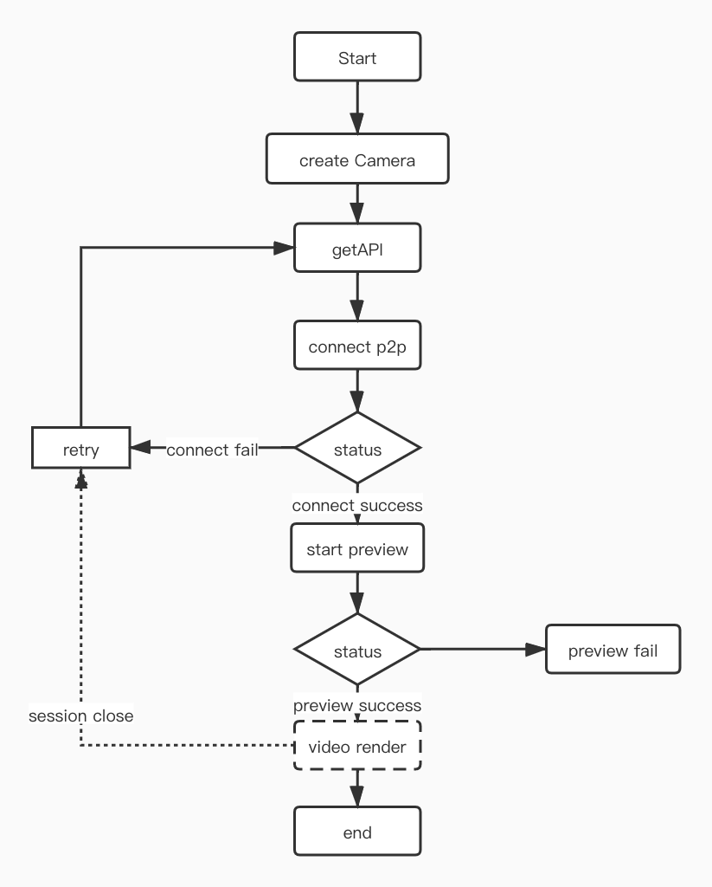

# Camera functions

Camera SDK provides live video of smart cameras, device memory card video playback, screenshots, recorded videos, and real-time calls with cameras. It also provides YUV data after video frame decoding. Developers can Perform secondary processing on the video data.

## Live Video

For live video, you need to obtain the cloud server information, then create an `ICameraP2P` object, and then make a P2P connection to play the live video, Screenshots, recorded videos, and real-time intercom data transfers.


### init

`ICameraP2P` needs to bind the render view. Users need to create `ICameraP2P` and `TuyaCameraView`, then use `TuyaCameraView` to construct the rendering view, and also need to register `OnP2PCameraListener`, `CreateVideoViewCallback`.

#### 1. create ICameraP2P object

**Declaration**

```java
public static ICameraP2P generateTuyaSmartCamera(int sdkprovider);
```


**Parameter**

|     Parameter     |   Description   |
| ------------ | ------- |
| sdkprovider | device type. Obtained from DeviceBean, see [P2p Type](./home_device.md#Camera device) |

**Example**


```java
ICameraP2P mCameraP2P = TuyaSmartCameraP2PFactory.generateTuyaSmartCamera(sdkProvider);
```

#### 2. Set callback for render view container

**Declaration**

```java
public void setCameraViewCallback(CreateVideoViewCallback callback)
```

**Parameter**

| Parameter |    Description     |
| --------- | ------------------- |
| callback  | Callback interface |

**Example**


```java
TuyaCameraView mVideoView = findViewById(R.id.camera_video_view);
mVideoView.setCameraViewCallback(new TuyaCameraView.CreateVideoViewCallback() {
    @Override
    public void onCreated(Object o) {
        //Callback when render view construction is completed
    }

    @Override
    public void videoViewClick() {

    }

    @Override
    public void startCameraMove(PTZDirection ptzDirection) {

    }

    @Override
    public void onActionUP() {

    }
});
```

#### 3. Create render view

**Declaration**


```java
public void createVideoView(int provider);
```

**Parameter**


| Parameter | Description |
| --------- | ------------ |
| provider  | device type |

**Example**

```
TuyaCameraView mVideoView = findViewById(R.id.camera_video_view);
mVideoView.createVideoView(sdkProvider);
```

**Declaration**

Get render view

> if the render view is not constructed, will return null

```java
public Object createdView();
```
**Example**

```java
TuyaCameraView mVideoView = findViewById(R.id.camera_video_view);
mVideoView.createdView()
```

#### 4. Bind the render view for ICameraP2P

**Declaration**


```java
void generateCameraView(T view);
```

**Example**


```java
mCameraP2P.generateCameraView(mVideoView.createdView());
```

#### link code

**Example**


```java
// 1. create ICameraP2P object
ICameraP2P mCameraP2P = TuyaSmartCameraP2PFactory.generateTuyaSmartCamera(sdkProvider);
// 2. set callback for render view contaienr
TuyaCameraView mVideoView = findViewById(R.id.camera_video_view);
mVideoView.setCameraViewCallback(new TuyaCameraView.CreateVideoViewCallback() {
    @Override
    public void onCreated(Object o) {
        //4. when render view construction is completed, bind render view for ICameraP2P
        mCameraP2P.generateCameraView(mVideoView.createdView());
    }

    @Override
    public void videoViewClick() {

    }

    @Override
    public void startCameraMove(PTZDirection ptzDirection) {

    }

    @Override
    public void onActionUP() {

    }
});
// 3. create render view IMonitorView
mVideoView.createVideoView(sdkProvider);
```

### Get device information

Get device configuration related information by calling the cloud interface.

**Declaration**


```java
void requestCameraInfo(String devId, ICameraConfig callback);
```

**Parameter**


| Parameter |   Description   |
| --------- | ---------------- |
| devId     | device id       |
| callback  | result callback |

**Example**


```java
TuyaSmartCameraP2P mSmartCameraP2P = new TuyaSmartCameraP2P();
mSmartCameraP2P.requestCameraInfo(devId, new ICameraConfig() {
    @Override
    public void onSuccess(BusinessResponse var1, ConfigCameraBean var2, String var3) {

    }

    @Override
    public void onFailure(BusinessResponse var1, ConfigCameraBean var2, String var3) {

    }
}
```

### Create device

Create a device after obtaining device configuration information, and then make a P2P connection

**Declaration**

```java
void createDevice(OperationDelegateCallBack callback, ConfigCameraBean bean);
```

**Parameter**


| Parameter |                                     Description                                     |
| --------- | ------------------------------------------------------------------------------------ |
| callback  | result callback                                                                     |
| bean      | Configuration information, it will be returned when obtaining device information |

**Example**

```java
mCameraP2P.createDevice(new OperationDelegateCallBack() {
    @Override
    public void onSuccess(int sessionId, int requestId, String data) {

    }

    @Override
    public void onFailure(int sessionId, int requestId, int errCode) {

    }
}, bean);
```

### P2P connection

Before starting video playback, you need to connect the P2P channel. The P2P status needs to be maintained by the user. The SDK is only responsible for issuing instructions and receiving camera response results.


**Declaration**


开始连接 P2P 通道

```java
void connect(OperationDelegateCallBack callBack);
```

断开 P2P 通道

```java
void disconnect(OperationDelegateCallBack callBack);
```

**Parameter**

| Parameter |   Description   |
| --------- | ---------------- |
| callBack  | result callback |


**Example**


```java
mCameraP2P.connect(new OperationDelegateCallBack() {
    @Override
    public void onSuccess(int sessionId, int requestId, String data) {

    }

    @Override
    public void onFailure(int sessionId, int requestId, int errCode) {

    }
});
```

### Live video

After the p2p channel is successfully connected, you can start playing live video.

**Declaration**


Start playing live video.

```java
void startPreview(int clarity, OperationDelegateCallBack callBack);
```

Stop playing live video.

```java
int stopPreview(OperationDelegateCallBack callBack);
```

**Parameter**


| Parameter |   Description   |
| --------- | ---------------- |
| clarity   | sharpness       |
| callBack  | result callback |


**Clarity model**

```java
public interface ICameraP2P<T> {
  /**
   * HD
   */
  int HD = 4;
  /**
   * SD
   */
  int STANDEND = 2;
  ...
}
```

**Example**


```java
mCameraP2P.startPreview(new OperationDelegateCallBack() {
    @Override
    public void onSuccess(int sessionId, int requestId, String data) {

    }

    @Override
    public void onFailure(int sessionId, int requestId, int errCode) {

    }
});
```

> Note: After the startPreview callback is successful, the onReceiveFrameYUVData callback will start receiving video data and throw it to the business layer.


### Destroy ICameraP2P

Destroy the object, when you no longer use the camera function, you must call destroy

**Example**

```java
TuyaSmartCameraP2PFactory.onDestroyTuyaSmartCamera();   
```


## Flow chart




