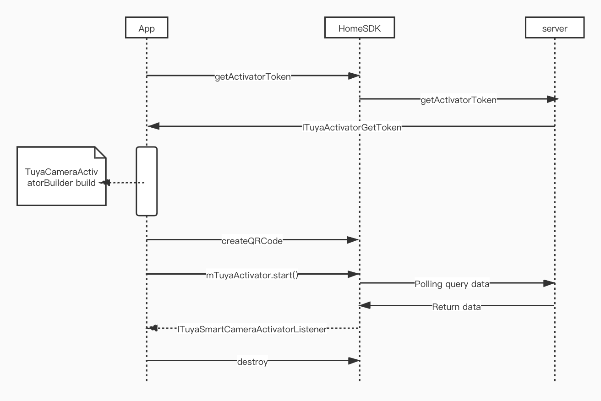

# Camera network configuration


## Introduction

Tuya IPC cameras mainly support the following configuration methods：

- EZ mode 
- AP mode
- QRcode mode

> The QR code mode is relatively simple. It is recommended to use a QR code to configure the network. If the device cannot scan the QR code, try EZ mode.

**EZ** mode & **AP** mode  can be checked  through [**Tuya Smart Android SDK network configuration document**](https://tuyainc.github.io/tuyasmart_home_android_sdk_doc/en/resource/Activator.html), This document focuses on Qrcode configuration.


## Use


###  Get current WIFI SSID

```java
WiFiUtil.getCurrentSSID()
```


### Get activator token

Token is valid in 10min, and become invalid once completely set（need to get Token again for next configuration） . Get Token as follows:

```java
void getActivatorToken(final long homeId, final ITuyaActivatorGetToken activatorGetToken);
```

**Parameter Description**

| Parameter              | Description        |
| ---------------------- | ------------------ |
| homeid                 | Home Id            |
| ITuyaActivatorGetToken | Get token callback |

**Sample code**

```java
//need homeid
TuyaHomeSdk.getActivatorInstance().getActivatorToken (homeid, new ITuyaActivatorGetToken() {
            @Override
            public void onSuccess(String token) {
                // get token successfully
            }

            @Override
            public void onFailure(String s, String s1) {
                // get token unsuccessfully
            }
        })
```


### TuyaCameraActivatorBuilder

Create TuyaCameraActivatorBuilder to save  Qrcode url information and callback interface. The method is shown below.

```java
TuyaCameraActivatorBuilder builder = new TuyaCameraActivatorBuilder()
    .setToken(token)
    .setPassword(password) // set wifi password
    .setSsid(ssid)
    .setListener(listener);
```

**Parameter Description**

| Parameter                         | Description   |
| --------------------------------- | ------------- |
| token                             | active token  |
| password                          | wifi password |
| ssid                              | wifi ssId     |
| ITuyaSmartCameraActivatorListener | Callback      |


### ITuyaCameraDevActivator

Network configuration interface implementation

```java
ITuyaCameraDevActivator mTuyaActivator = TuyaHomeSdk.getActivatorInstance().newCameraDevActivator(builder);
```


### Get Qrcode url information through Qrcode interface

```java
mTuyaActivator.createQRCode();
```


### start network configuration 


Use the url to generate Qrcode, and confirm the device is in network configuration mode. Point the camera at the Qrcode, the device will emit a tone or switch the indicator once it get Qrcode information. Then monitor the configuration result by belowing interface:

```java
// network configuration start
mTuyaActivator.start();
```


### stop network configuration


The method is shown below:

```java
//Stop configuration
mTuyaActivator.stop();
```


### Network configuration result callback


Callback configuration result by ITuyaSmartCameraActivatorListener interface,

```java
// callback interface
ITuyaSmartCameraActivatorListener() {

    /**
     * Qrcode generate successfully
     *
     * @param qrcodeUrl 
     */
    void onQRCodeSuccess(String qrcodeUrl);
    /**
     * error messege
     *
     * @param errorCode 
     * @param errorMsg  
     */
    void onError(String errorCode, String errorMsg);
    /**
     * active success
     *
     * @param devResp  device id
     */
    void onActiveSuccess(DeviceBean devResp);
};

```

**Method description**

| Method          | Description                                                  |
| --------------- | ------------------------------------------------------------ |
| onQRCodeSuccess | Generate QR code URL successfully callback, callback parameter is QR code URL address |
| onError         | Error message                                                |
| onActiveSuccess | Activated successfully                                       |


### Callback destroy

```java
//callback destroy
mTuyaActivator.onDestroy();
```

### 

### Sample code

```java
//initialization callback interface
ITuyaSmartCameraActivatorListener mListener = new ITuyaSmartCameraActivatorListener() {
    /**
     * Qrcode generation success
     *
     * @param qrcodeUrl
     */
    public void onQRCodeSuccess(String qrcodeUrl){
        //use url to generate Qrcode
    }
    /**
     * error message
     *
     * @param errorCode 
     * @param errorMsg  
     */
    public void onError(String errorCode, String errorMsg){
        //The reason of failure and the list of error, reference AP\EZ network configuration
    }
    /**
     * active successfully
     *
     * @param devResp device id
     */
    public void onActiveSuccess(DeviceBean devResp){
        //subsequent operations
        
    }
};
TuyaCameraActivatorBuilder builder = new TuyaCameraActivatorBuilder()
    .setToken(token)
    .setPassword(password) // import wifi password
    .setSsid(ssid)
    .setListener(listener); 
ITuyaCameraDevActivator mTuyaActivator =    TuyaHomeSdk.getActivatorInstance().newCameraDevActivator(builder);
//generate Qrcode url
mTuyaActivator.createQRCode();
//configuration start
mTuyaActivator.start();
//configuration stop
mTuyaActivator.stop();
//callback destroy
mTuyaActivator.onDestroy();

```


## Timing diagram

