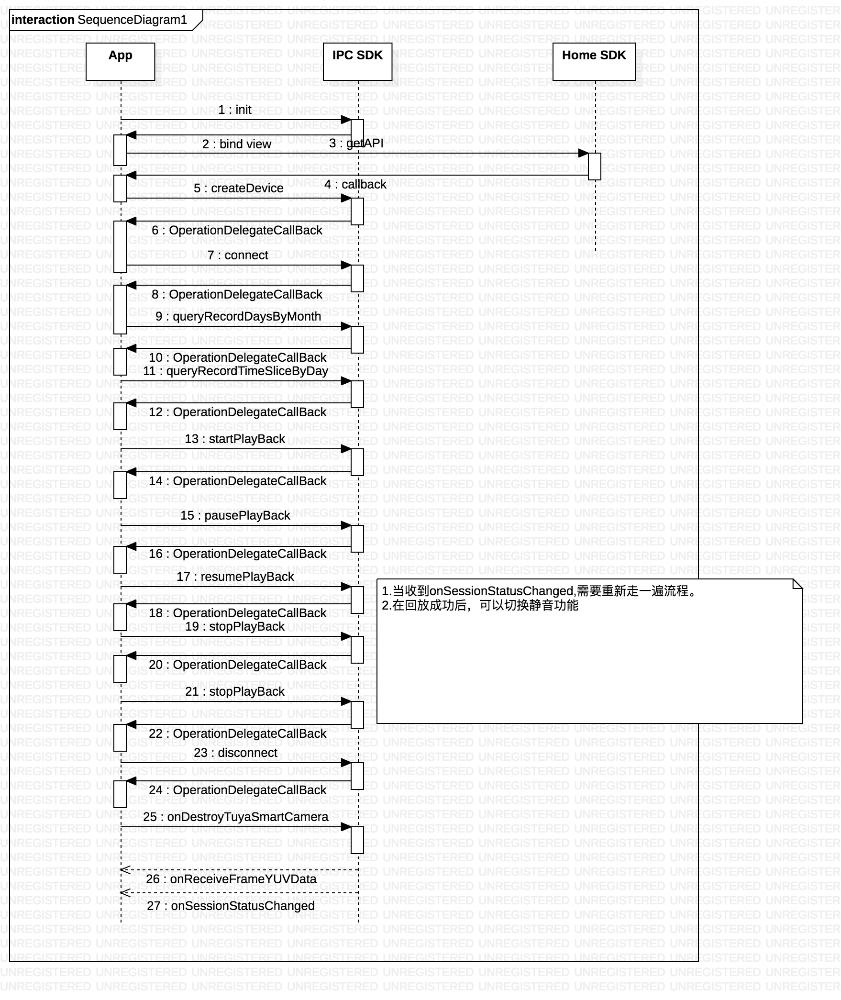

# IPC Camera SDK回放功能方法调用及生命周期


## 示例代码

### 主要链路代码


1. 初始化

   IPC Camera SDK需要绑定Monitor，使用者首先要创建Monitor，并在初始化的时候给绑定到camera sdk中，同时要把OnP2PCameraListener注入。如下所示：

   ```java
   private static final int ASPECT_RATIO_WIDTH = 9;
   private static final int ASPECT_RATIO_HEIGHT = 16;
   @Override
       protected void onCreate(Bundle savedInstanceState) {
           ···
        initView();
        initData();
        initListener();
   		...
       }
   ```

   ```java
   private void initView() {
           ...
           mVideoView = findViewById(R.id.camera_video_view);
           ...
   
           //播放器view最好宽高比设置16:9
           WindowManager windowManager = (WindowManager) this.getSystemService(WINDOW_SERVICE);
           int width = windowManager.getDefaultDisplay().getWidth();
           int height = width * ASPECT_RATIO_WIDTH / ASPECT_RATIO_HEIGHT;
           RelativeLayout.LayoutParams layoutParams = new RelativeLayout.LayoutParams(width, height);
           layoutParams.addRule(RelativeLayout.BELOW, R.id.toolbar_view);
           findViewById(R.id.camera_video_view_Rl).setLayoutParams(layoutParams);
   
   }
   ```

   ```java
     private void initData() {
           localKey = getIntent().getStringExtra(INTENT_LOCALKEY);
           devId = getIntent().getStringExtra(INTENT_DEVID);
           sdkProvider = getIntent().getIntExtra(INTENT_SDK_POROVIDER, -1);
           mIsRunSoft = getIntent().getBooleanExtra("isRunsoft", true);
           if (null != TuyaHomeSdk.getUserInstance().getUser()) {
               mlocalId = TuyaHomeSdk.getUserInstance().getUser().getUid();
           }
           mCameraP2P = TuyaSmartCameraP2PFactory.generateTuyaSmartCamera(sdkProvider);
           mDeviceControl = TuyaCameraDeviceControlSDK.getCameraDeviceInstance(devId);
       		mCameraP2P.generateCameraView(mVideoView); //绑定 monitor
           getApi(); //获取设备信息
       }
   ```

   ```java
   private void getApi() {
           Map postData = new HashMap();
           postData.put("devId", devId);
           TuyaHomeSdk.getRequestInstance().requestWithApiName("tuya.m.ipc.config.get", "2.0",
                   postData, new IRequestCallback() {
                       @Override
                       public void onSuccess(Object o) {
                           infoBean = JSONObject.parseObject(o.toString(), CameraInfoBean.class);
                           Log.d("onSuccess", o.toString());
                           mP2p3Id = infoBean.getId(); // not support yet
                           p2pType = infoBean.getP2pSpecifiedType();
                           p2pId = infoBean.getP2pId().split(",")[0];
                           p2pWd = infoBean.getPassword();
                           mInitStr = infoBean.getP2pConfig().getInitStr();
                           mP2pKey = infoBean.getP2pConfig().getP2pKey();
                           mInitStr += ":" + mP2pKey;
                           if (null != infoBean.getP2pConfig().getIces()) {
                               token = infoBean.getP2pConfig().getIces().toString();
                           }
                           initCameraView();
                       }
   
                       @Override
                       public void onFailure(String s, String s1) {
                           ToastUtil.shortToast(CameraPanelActivity.this, "get cameraInfo failed");
                       }
                   });
       }
   ```

   ```java
    //播放模式
      	public static enum PLAYMODE {
              LIVE(0),     //直播
              PLAYBACK(1); //回放
      
              int value;
      
              private PLAYMODE(int value) {
                  this.value = value;
              }
      
              public int getValue() {
                  return this.value;
              }
          }
   ```
   
2. 初始化回调

   ```java
       private void initCameraView() {
           mCameraP2P.createDevice(new OperationDelegateCallBack() {
               @Override
               public void onSuccess(int sessionId, int requestId, String data) {
                   mHandler.sendMessage(MessageUtil.getMessage(MSG_CREATE_DEVICE, ARG1_OPERATE_SUCCESS));
               }
   
               @Override
               public void onFailure(int sessionId, int requestId, int errCode) {
                   mHandler.sendMessage(MessageUtil.getMessage(MSG_CREATE_DEVICE, ARG1_OPERATE_FAIL));
               }
           },configCameraBean);
       }
   ```

3. connect 连线

   摄像头p2p连接操作及回调方法

   ```java
           mCameraP2P.connect(new OperationDelegateCallBack() {
               @Override
               public void onSuccess(int sessionId, int requestId, String data) {
                   mHandler.sendMessage(MessageUtil.getMessage(MSG_CONNECT, ARG1_OPERATE_SUCCESS));
               }
   
               @Override
               public void onFailure(int sessionId, int requestId, int errCode) {
                   mHandler.sendMessage(MessageUtil.getMessage(MSG_CONNECT, ARG1_OPERATE_FAIL, errCode));
               }
           });
   ```

4. 获取有回放视频记录的日期

   ```java
   int year = Integer.parseInt(substring[0]);
                       int mouth = Integer.parseInt(substring[1]);
                       queryDay = Integer.parseInt(substring[2]);
                       mCameraP2P.queryRecordDaysByMonth(year, mouth, new OperationDelegateCallBack() {
                           @Override
                           public void onSuccess(int sessionId, int requestId, String data) {
                           //data是获取到的月份数据
                               MonthDays monthDays = JSONObject.parseObject(data, MonthDays.class);
                               mBackDataMonthCache.put(mCameraP2P.getMonthKey(), monthDays.getDataDays());
                               mHandler.sendMessage(MessageUtil.getMessage(MSG_DATA_DATE, ARG1_OPERATE_SUCCESS, data));
                           }
   
                           @Override
                           public void onFailure(int sessionId, int requestId, int errCode) {
                               mHandler.sendMessage(MessageUtil.getMessage(MSG_DATA_DATE, ARG1_OPERATE_FAIL));
                           }
                       }); 
   ```

   > 在开始回放前，需要获取到回放视频记录的信息。首先获取有回放视频记录的日期

5. 获取某日的视频回放信息

   ```&gt; java
   int year = Integer.parseInt(substring[0]);
                   int mouth = Integer.parseInt(substring[1]);
                   int day = Integer.parseInt(substring[2]);
                   mCameraP2P.queryRecordTimeSliceByDay(year, mouth, day, new OperationDelegateCallBack() {
                       @Override
                       public void onSuccess(int sessionId, int requestId, String data) {					//data是获取到的日期时间片段数据
                           parsePlaybackData(data);
                       }
   
                       @Override
                       public void onFailure(int sessionId, int requestId, int errCode) {
                           mHandler.sendEmptyMessage(MSG_DATA_DATE_BY_DAY_FAIL);
                       }
                   });
   ```

   > 获取到有用回放记录的日期后，根据日期获取当日的视频回放记录

6. 开启回放

   ```java
   mCameraP2P.startPlayBack(timePieceBean.getStartTime(),
                           timePieceBean.getEndTime(),
                           timePieceBean.getStartTime(), new OperationDelegateCallBack() {
                               @Override
                               public void onSuccess(int sessionId, int requestId, String data) {
                                   isPlayback = true;
                               }
   
                               @Override
                               public void onFailure(int sessionId, int requestId, int errCode) {
                                   isPlayback = false;
                               }
                           }, new OperationDelegateCallBack() {
                               @Override
                               public void onSuccess(int sessionId, int requestId, String data) {
                                   isPlayback = false;
                               }
   
                               @Override
                               public void onFailure(int sessionId, int requestId, int errCode) {
                                   isPlayback = false;
                               }
                           });
   ```
   

7. 暂停回放

   ```java
      mCameraP2P.pausePlayBack(new OperationDelegateCallBack() {
               @Override
               public void onSuccess(int sessionId, int requestId, String data) {
                   isPlayback = false;
               }
   
               @Override
               public void onFailure(int sessionId, int requestId, int errCode) {
   
               }
           });
   ```

8. 恢复回放

   ```java
   mCameraP2P.resumePlayBack(new OperationDelegateCallBack() {
               @Override
               public void onSuccess(int sessionId, int requestId, String data) {
                   isPlayback = true;
               }
   
               @Override
               public void onFailure(int sessionId, int requestId, int errCode) {
   
               }
           });
   ```

9. 回放结束回调

   ```java
   	mCameraP2P.stopPlayBack(new OperationDelegateCallBack() {
               @Override
               public void onSuccess(int sessionId, int requestId, String data) {
   
               }
   
               @Override
               public void onFailure(int sessionId, int requestId, int errCode) {
   
               }
           });
   ```

   

10. disconnect断开连线,离开页面的时候可以选择断开p2p连接

   ```java
     mCameraP2P.disconnect(new OperationDelegateCallBack() {
                @Override
                public void onSuccess(int sessionId, int requestId, String data) {
                    
                }
   
                @Override
                public void onFailure(int sessionId, int requestId, int errCode) {
   
                }
            });
   ```

11. destroy销毁对象，不再使用camera功能的时候，一定要调用destroy

    ```java
       TuyaSmartCameraP2PFactory.onDestroyTuyaSmartCamera();   
    ```

>  以上方法调用构成摄像头live的生命周期


### 回放开启成功后，可调用信令

#### 开启视频录制

```java
if (Constants.hasStoragePermission()) {
                String picPath = Environment.getExternalStorageDirectory().getAbsolutePath() + "/Camera/";
                File file = new File(picPath);
                if (!file.exists()) {
                    file.mkdirs();
                }
                String fileName = System.currentTimeMillis() + ".mp4";
                videoPath = picPath + fileName;
                mCameraP2P.startRecordLocalMp4(picPath, fileName, CameraPanelActivity.this, new OperationDelegateCallBack() {
                    @Override
                    public void onSuccess(int sessionId, int requestId, String data) {
                        isRecording = true;
                        mHandler.sendEmptyMessage(MSG_VIDEO_RECORD_BEGIN);

                    }

                    @Override
                    public void onFailure(int sessionId, int requestId, int errCode) {
                        mHandler.sendEmptyMessage(MSG_VIDEO_RECORD_FAIL);
                    }
                });
                recordStatue(true);
            } else {
                Constants.requestPermission(CameraPanelActivity.this, Manifest.permission.WRITE_EXTERNAL_STORAGE, Constants.EXTERNAL_STORAGE_REQ_CODE, "open_storage");
            } 
```

> 注：录制视频需要写存储卡权限

#### 停止视频录制

```java
mCameraP2P.stopRecordLocalMp4(new OperationDelegateCallBack() {
                @Override
                public void onSuccess(int sessionId, int requestId, String data) {
                    isRecording = false;
                    //data 返回的是文件路径
                    mHandler.sendMessage(MessageUtil.getMessage(MSG_VIDEO_RECORD_OVER, ARG1_OPERATE_SUCCESS, data));
                }

                @Override
                public void onFailure(int sessionId, int requestId, int errCode) {
                    isRecording = false;
                    mHandler.sendMessage(MessageUtil.getMessage(MSG_VIDEO_RECORD_OVER, ARG1_OPERATE_FAIL));
                }
            });
```

#### 视频截图

```java
if (Build.VERSION.SDK_INT >= Build.VERSION_CODES.KITKAT) {
            String path = Environment.getExternalStorageDirectory().getAbsolutePath() + "/Camera/";
            File file = new File(path);
            if (!file.exists()) {
                file.mkdirs();
            }
            picPath = path;
        }
        mCameraP2P.snapshot(picPath, CameraPanelActivity.this, ICameraP2P.PLAYMODE.LIVE, new OperationDelegateCallBack() {
            @Override
            public void onSuccess(int sessionId, int requestId, String data) {
             //data 返回的是文件路径
                mHandler.sendMessage(MessageUtil.getMessage(MSG_SCREENSHOT, ARG1_OPERATE_SUCCESS, data));
            }

            @Override
            public void onFailure(int sessionId, int requestId, int errCode) {
                mHandler.sendMessage(MessageUtil.getMessage(MSG_SCREENSHOT, ARG1_OPERATE_FAIL));
            }
        });
```

#### 设置拾音器状态

```java
        int mute;
        mute = previewMute == ICameraP2P.MUTE ? ICameraP2P.UNMUTE : ICameraP2P.MUTE;
        mCameraP2P.setMute(ICameraP2P.PLAYMODE.LIVE, mute, new OperationDelegateCallBack() {
            @Override
            public void onSuccess(int sessionId, int requestId, String data) {
            		//data返回的是对应操作之后的结果值
                previewMute = Integer.valueOf(data);
                mHandler.sendMessage(MessageUtil.getMessage(MSG_MUTE, ARG1_OPERATE_SUCCESS));
            }

            @Override
            public void onFailure(int sessionId, int requestId, int errCode) {
                mHandler.sendMessage(MessageUtil.getMessage(MSG_MUTE, ARG1_OPERATE_FAIL));
            }
        });
```

#### 开启对讲

```java
if (Constants.hasRecordPermission()) {
                mCameraP2P.startAudioTalk(new OperationDelegateCallBack() {
                    @Override
                    public void onSuccess(int sessionId, int requestId, String data) {
                        isSpeaking = true;
                        mHandler.sendMessage(MessageUtil.getMessage(MSG_TALK_BACK_BEGIN, ARG1_OPERATE_SUCCESS));
                        ToastUtil.shortToast(CameraPanelActivity.this, "start talk success");
                    }

                    @Override
                    public void onFailure(int sessionId, int requestId, int errCode) {
                        isSpeaking = false;
                        mHandler.sendMessage(MessageUtil.getMessage(MSG_TALK_BACK_BEGIN, ARG1_OPERATE_FAIL));
                        ToastUtil.shortToast(CameraPanelActivity.this, "operation fail");

                    }
                });
            } else {
                Constants.requestPermission(CameraPanelActivity.this, Manifest.permission.RECORD_AUDIO, Constants.EXTERNAL_AUDIO_REQ_CODE, "open_recording");
            }
```

## 时序图


