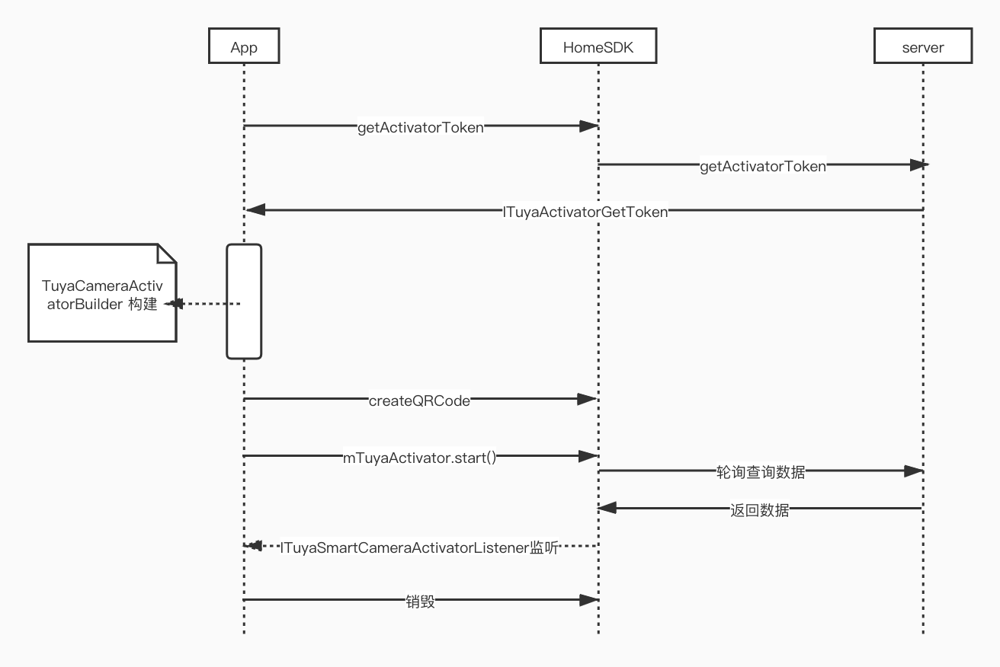

# 设备配网


## 描述

涂鸦 IPC 摄像机主要支持以下配网模式：

-  快连模式( EZ 模式)
-  热点模式( AP 模式)
-  二维码模式( Qrcode 模式)

> 二维码模式配网比较简单，建议使用二维码配网，如果设备扫描不了二维码，再尝试快连模式。

**快连模式**和**热点模式**这两种配网方式和涂鸦其他设备的配网方式是一样的可以查看 [**涂鸦全屋智能 SDK 文档配网**](https://mimimumu.github.io/tuyasmart_home_android_sdk_doc/zh-hans/resource/Activator_wifi.html), 这里重点讲解一下 Qrcode 的配网文档。


## 使用方法

### 获取当前的 Wifi SSID

```java
WiFiUtil.getCurrentSSID()
```

### 获取配网 Token

Token 的有效期为10分钟，且配置成功后就会失效（再次配网需要重新获取）,获取方法如下：

```java
void getActivatorToken(final long homeId, final ITuyaActivatorGetToken activatorGetToken);
```
**参数说明**

| 参数    | 说明                               |
| ------- | ---------------------------------- |
| homeid | 家庭 id |
| ITuyaActivatorGetToken | 获取 token 的回调 |

**示例代码**

```java//需要传入当前家庭的homeid
TuyaHomeSdk.getActivatorInstance().getActivatorToken (homeid, new ITuyaActivatorGetToken() {
            @Override
            public void onSuccess(String token) {
                //获取token成功
            }

            @Override
            public void onFailure(String s, String s1) {
                //获取token失败
            }
        })
```


### TuyaCameraActivatorBuilder

通过创建 `TuyaCameraActivatorBuilder` 对象来存储二维码url信息，及接口回调。方法如下：

```java
TuyaCameraActivatorBuilder builder = new TuyaCameraActivatorBuilder()
    .setToken(token)
    .setPassword(password) //传入wifi的password
    .setSsid(ssid)
    .setListener(listener); //传入ITuyaSmartCameraActivatorListener 监听对象
```
**参数说明**

| 参数    | 说明                               |
| ------- | ---------------------------------- |
| token | active token |
| password | wifi 的 password |
| ssid | wifi 的 ssid |
| ITuyaSmartCameraActivatorListener | 回调接口|


### ITuyaCameraDevActivator

配网接口实现

```java
ITuyaCameraDevActivator mTuyaActivator = TuyaHomeSdk.getActivatorInstance().newCameraDevActivator(builder);
```


### 调用二维码接口获取二维码 url 信息

```java
mTuyaActivator.createQRCode();
```


### 开始配网

使用上面生成的 url 生成二维码，确定设备处于配网状态，将生成的二维码对准摄像头，摄像头设备捕捉到二维码信息后会发出提示音或者灯光变化。此时通过以下接口开始监听配网结果。方法如下：

```java
//开始配置
mTuyaActivator.start();
```


### 停止配网

方法如下：

```java
//停止配置
mTuyaActivator.stop();
```


### 配网结果回调

配网结果通过 `ITuyaSmartCameraActivatorListener`  配网回调接口，方法如下：

```java
//回调接口
ITuyaSmartCameraActivatorListener() {

    /**
     * 二维码生成成功
     *
     * @param qrcodeUrl 二维码 URL
     */
    void onQRCodeSuccess(String qrcodeUrl);
    /**
     * 错误信息
     *
     * @param errorCode 错误码
     * @param errorMsg  错误信息
     */
    void onError(String errorCode, String errorMsg);
    /**
     * 激活成功
     *
     * @param devResp 设备ID
     */
    void onActiveSuccess(DeviceBean devResp);
};

```
#### 方法说明

| 方法    | 说明                               |
| ------- | ---------------------------------- |
| onQRCodeSuccess | 生成二维码 URL 成功回调，回调参数即为二维码 url 地址 |
| onError | 错误信息 |
| onActiveSuccess | 激活成功 |


### 回调销毁

```java
//回调销毁
mTuyaActivator.onDestroy();
```


### 二维码配网参考示例代码

```java
//初始化回调接口
ITuyaSmartCameraActivatorListener mListener = new ITuyaSmartCameraActivatorListener() {
    /**
     * 二维码生成成功
     *
     * @param qrcodeUrl 二维码 URL
     */
    public void onQRCodeSuccess(String qrcodeUrl){
        //使用url生成二维码
    }
    /**
     * 错误信息
     *
     * @param errorCode 错误码
     * @param errorMsg  错误信息
     */
    public void onError(String errorCode, String errorMsg){
        //配网失败的原因及错误列表，具体参考AP、EZ配网
    }
    /**
     * 激活成功
     *
     * @param devResp 设备 ID
     */
    public void onActiveSuccess(DeviceBean devResp){
        //配网成功后续操作
        
    }
};
TuyaCameraActivatorBuilder builder = new TuyaCameraActivatorBuilder()
    .setToken(token)
    .setPassword(password) //传入wifi的password
    .setSsid(ssid)
    .setListener(listener); //传入ITuyaSmartCameraActivatorListener 监听对象

ITuyaCameraDevActivator mTuyaActivator =    TuyaHomeSdk.getActivatorInstance().newCameraDevActivator(builder);
//生成二维码url
mTuyaActivator.createQRCode();
//开始配置
mTuyaActivator.start();
//停止配置
mTuyaActivator.stop();
//回调销毁
mTuyaActivator.onDestroy();
```


## 时序图

